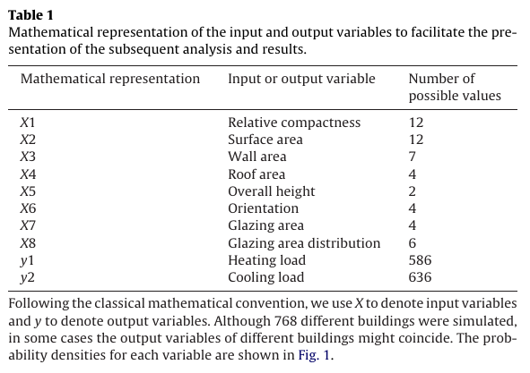

```{r}
# imports for the project
rm(list=ls())
knitr::opts_chunk$set(echo = TRUE, include = TRUE, message = FALSE, warning = FALSE)
library(mice)
library(psych)
library(ggplot2)
library(tableplot)
library(reshape2)
library(chemometrics)
library(pracma)
#Add library
library(PerformanceAnalytics)
```

# About

From UCI's Machine Learning repository description in https://archive.ics.uci.edu/ml/datasets/Energy+efficiency 

> Abstract: This study looked into assessing the heating load and cooling load requirements of buildings (that is, energy efficiency) as a function of building parameters.
	

> We perform energy analysis using 12 different building shapes simulated in Ecotect. The buildings differ with respect to the glazing area, the glazing area distribution, and the orientation, amongst other parameters. We simulate various settings as functions of the afore-mentioned characteristics to obtain 768 building shapes. The dataset comprises 768 samples and 8 features, aiming to predict two real valued responses. It can also be used as a multi-class classification problem if the response is rounded to the nearest integer.



```{r}
df <- readxl::read_xlsx("data/ENB2012_data.xlsx")
head(df)
```

> The dataset contains eight attributes (or features, denoted by X1...X8) and two responses (or outcomes, denoted by y1 and y2). The aim is to use the eight features to predict each of the two responses.


```{r}
class(df)
```

Specifically:
X1 Relative Compactness
X2 Surface Area
X3 Wall Area
X4 Roof Area
X5 Overall Height
X6 Orientation
X7 Glazing Area
X8 Glazing Area Distribution
y1 Heating Load
y2 Cooling Load

```{r}
colnames(df)
```

```{r}
colnames(df) <- c("X1.RelativeCompactness",
"X2.SurfaceArea",
"X3.WallArea",
"X4.RoofArea",
"X5.OverallHeight",
"X6.Orientation",
"X7.GlazingArea",
"X8.GlazingAreaDistribution",
"y1.HeatingLoad",
"y2.CoolingLoad")

head(df)
```


```{r}
describe(df)
```

## Separating datasets in inputs and response variables

```{r}
df.X <- df[,-grep("Load$", colnames(df))]
df.y <- df[,grep("Load$", colnames(df))]
```


## Imputing missing data

```{r}
md.pattern(df, plot = FALSE)
```


## Data visualizations

```{r}
# https://datacritics.com/2018/02/28/melt-your-data-for-fast-visuals-with-your-dataset-in-r/
melt.df <- melt(df)
ggplot(data = melt.df, aes(x = value)) + 
  stat_density() + 
  facet_wrap(~variable, scales = "free")
```

## Histograms

```{r}
par(mfrow=c(2, 5))
colnames <- colnames(df)
for (i in 1:10) {
    hist(as.numeric(unlist(df[,i])), main=colnames[i], probability=TRUE, col="gray", border="white")
}

```

## Check Correlations

```{r}
chart.Correlation(df, histogram=TRUE)
```

## Outlier Detection

### Using plain euclidean distances

```{r}
# https://stackoverflow.com/questions/44089894/identifying-the-outliers-in-a-data-set-in-r
OutVals <-  boxplot(df)$out
#which(df %in% OutVals)
```

### Using mahalanobis distances (covariance matrix is singular, find out what it means)

```{r eval=FALSE}
# normalize dataset
m <- df.X
m <- scale(m, center=TRUE, scale=colSums(m))
Moutlier(m, quantile = 0.975, plot = TRUE)
```

This matrix is not invertible. Two fundamental linear algebra properties:

- A singular (square) matrix is a (square) matrix that is not invertible.
- A matrix is not invertible if its determinant equals zero.

We can check the condition number

```{r}
# https://stackoverflow.com/questions/50928796/system-is-computationally-singular-reciprocal-condition-number-in-r
# https://en.wikipedia.org/wiki/Condition_number
# https://stats.stackexchange.com/questions/37743/singular-covariance-matrix-in-mahalanobis-distance-in-matlab
kappa(as.matrix(df.X))
```

```{r, include=TRUE, echo=TRUE }
mahalanobis2 <- function(df,
                         inv.pseudo = FALSE,
                         robust = TRUE,
                         plot = TRUE,
                         tol = 0.975) {
  # we can use the penrose-moore pseudoinverse instead of the normal inverse
  # https://stats.stackexchange.com/a/37810/101414
  
  # cite this as
  # kjetil b halvorsen (https://stats.stackexchange.com/users/11887/kjetil-b-halvorsen), Singular covariance matrix in Mahalanobis distance in Matlab, URL (version: 2012-09-22): https://stats.stackexchange.com/q/37810
  
  if (robust == TRUE) {
    # Uses the MCD estimator, according to
    
    # Mia Hubert, Peter J. Rousseeuw, Stefan Van Aelst,
    # 10 - Multivariate Outlier Detection and Robustness,
    # Editor(s): C.R. Rao, E.J. Wegman, J.L. Solka,
    # Handbook of Statistics,
    # Elsevier,
    # Volume 24,
    # 2005,
    # Pages 263-302,
    # ISSN 0169-7161,
    # ISBN 9780444511416,
    # https://doi.org/10.1016/S0169-7161(04)24010-X.
    
    # produce the MCD estimates
    df.mcd <- robustbase::covMcd(df)
    
    # center vectors using the MCD estimator
    xMinusM <- sweep(df, 2L, df.mcd$center)
    xMinusMTransposed <- t(xMinusM)
    
    if (inv.pseudo == TRUE) {
      inverseCovMatrix <- pinv(df.mcd$cov)
    } else {
      # using normal inverse
      inverseCovMatrix <- solve(df.mcd$cov)
    }
    
    left <- as.matrix(xMinusM) %*% as.matrix(inverseCovMatrix)
    mdSquared <- left %*% as.matrix(xMinusMTransposed)
    mdSquaredDiag <- diag(mdSquared)
    
  } else {
    # using classic mahalanobis
    xMinusM <- scale(df, scale = FALSE)
    
    xMinusMTransposed <- t(xMinusM)
    
    if (inv.pseudo == TRUE) {
      inverseCovMatrix <- pinv(var(df))
    } else {
      inverseCovMatrix <- solve(var(df))
    }
    left <- xMinusM %*% inverseCovMatrix
    mdSquared <- left %*% xMinusMTransposed
    mdSquaredDiag <- diag(mdSquared)
  }
  
  distances <- sqrt(mdSquaredDiag)
  
  # defining threshold
  threshold <- sqrt(qchisq(tol, ncol(df)))
  df$isOutlier <- (distances >= threshold)
  
  if (plot == TRUE){
    plot(densityplot(distances))
    plot(histogram(distances))
    # plot(df, col = df$isOutlier)
    # legend(7,4.3,unique(df$isOutlier),col=1:length(df$isOutlier),pch=1)
  }
  
  wrapper <- NULL
  wrapper$distances <- distances
  wrapper$isOutlier <- df$isOutlier
  return(wrapper)
}

mdRobustDistances <- mahalanobis2(df.X, robust = TRUE, inv.pseudo = TRUE, plot = TRUE)
```

```{r}
mdRobustDistances <- mahalanobis2(df.X, robust = TRUE, inv.pseudo = TRUE, plot = TRUE)
```

We can assume there are no outliers.

```{r}
length(mdRobustDistances[mdRobustDistances$isOutlier == TRUE])
```

